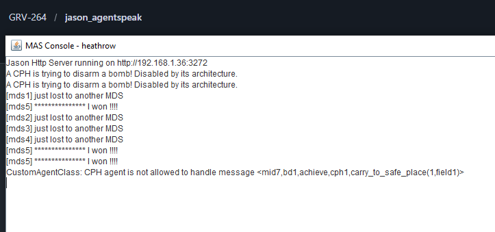

# Airport (Heathrow Robots)

## 📖 Descripción
Sistema multiagente que simula operaciones de seguridad en el aeropuerto de Heathrow, donde múltiples robots transportan equipaje y manejan situaciones de seguridad.

## 🎯 Objetivo del Ejemplo
Demostrar:
- Coordinación de múltiples agentes en ambiente simulado
- Arquitecturas personalizadas con restricciones de seguridad
- Comunicación entre agentes en sistemas complejos

## 🤖 Agentes Principales
- **MDS (Mobile Device Security)** - 5 robots que transportan equipaje y negocian tareas
- **CPH (Central Processing Hub)** - 2 agentes coordinadores (con arquitectura restringida)
- **BD (Database)** - 3 agentes de base de datos

## 📋 Comportamiento Esperado
1. El servidor HTTP se inicia en `http://localhost:3272`
2. Los agentes MDS negocian entre sí quién maneja cada bomba encontrada
3. Los agentes CPH intentan desactivar bombas pero son bloqueados por su arquitectura
4. Se observan mensajes como:
   - `"[mdsX] *************** I won !!!!"` - MDS ganó la negociación
   - `"[mdsX] just lost to another MDS"` - MDS perdió contra rival
   - `"CPH agent is not allowed to handle message"` - Arquitectura restrictiva en acción

## 📚 Conceptos Clave
- **Protocol de Negociación**: Los agentes compiten para obtener tareas
- **Arquitecturas Personalizadas**: El CPH tiene restricciones que le impiden ciertas acciones
- **Comunicación Broadcast**: Agentes se comunican globalmente sus ofertas

## 📖 Referencia
Basado en el ejemplo de Heathrow Robots del libro *Multi-Agent Programming* (Springer-Verlag, 2005)

## 📸 Salida de Ejemplo
