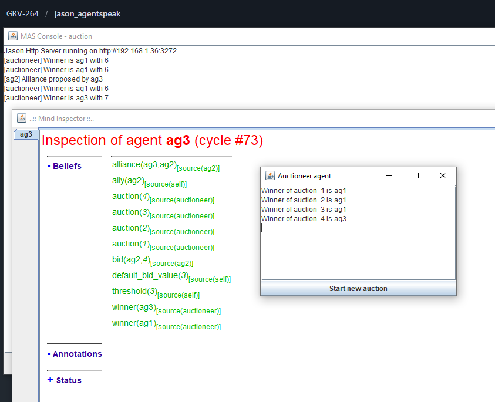

# Auction (First-Price Sealed-Bid Auction)

## 📖 Descripción
Sistema de subastas en primer precio con sobre cerrado, donde múltiples agentes compiten colocando pujas sobre un artículo.

## 🎯 Objetivo del Ejemplo
Demostrar:
- Comunicación entre agentes pujadores
- Toma de decisiones autónoma basada en precios y estrategias
- Interfaz GUI para monitoreo (AuctioneerGUI)

## 🤖 Agentes Principales
- **ag1, ag2, ag3** - Agentes pujadores (bidders) con diferentes estrategias
- **auctioneer** - Agente subastador que gestiona el proceso (incluye GUI visual)

## 📋 Comportamiento Esperado
1. Aparece una ventana gráfica del subastador (AuctioneerGUI)
2. Los agentes pujadores reciben la solicitud de puja
3. Cada agente calcula su puja independientemente
4. El subastador recopila todas las pujas
5. Se determina y anuncia al ganador (el que pujó más alto)

## 📚 Conceptos Clave
- **Autonomía de Decisión**: Cada agente decide cuánto pujar sin influencia externa
- **Comunicación Asincrónica**: Mensajes entre pujadores y subastador
- **GUI Integrada**: Visualización en tiempo real del proceso de subasta

## 💡 Variaciones Posibles
- Modificar estrategias de puja en `ag1.asl`, `ag2.asl`, `ag3.asl`
- Agregar más pujadores duplicando archivos `.asl`
- Cambiar el artículo en subasta o el precio de salida inicial

## 📸 Salida de Ejemplo
