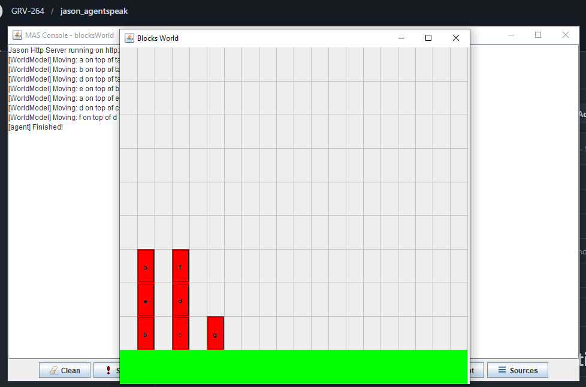

# Blocks World

## 📖 Descripción
Solución al problema clásico del "Mundo de los Bloques", donde agentes deben organizar bloques apilados en configuraciones específicas usando movimientos atómicos.

## 🎯 Objetivo del Ejemplo
Demostrar:
- Planificación jerárquica y descomposición de tareas
- Resolución de metas mediante planes recursivos
- Diferentes estrategias y optimizaciones

## 🤖 Agentes Principales
- **agent** - Versión básica simple
- **agent_o** - Versión optimizada
- **agent_c** - Versión con control de conflictos
- **agent_p** - Versión con preplanificación
- **agent_g** - Versión con goals avanzados

## 📋 Comportamiento Esperado
1. El agente observa el estado inicial de los bloques
2. Descompone la meta global en submetas para mover bloques individuales
3. Ejecuta acciones atómicas (move, pick, drop, putdown)
4. Finalmente dispone los bloques en la configuración objetivo
5. En variantes optimizadas, calcula movimientos más eficientes

## 📚 Conceptos Clave
- **Planificación por Refinamiento**: Descomponer metas complejas en submetas simples
- **Recursión**: Los planes se llaman a sí mismos para resolver problemas más pequeños
- **Optimización**: Diferentes variantes muestran estrategias de mejora

## 💡 Ejemplo de Meta
```
Meta: Tener bloque C sobre bloque B
│
├─ Descompuesto en:
│  ├─ Liberar C (quitarle encima lo que esté)
│  ├─ Liberar B (asegurar que C quepa encima)
│  └─ Colocar C sobre B
```

## 📖 Referencia
Problema clásico de IA introductoria, usado en STRIPS y planificadores similares

## 📸 Salida de Ejemplo

