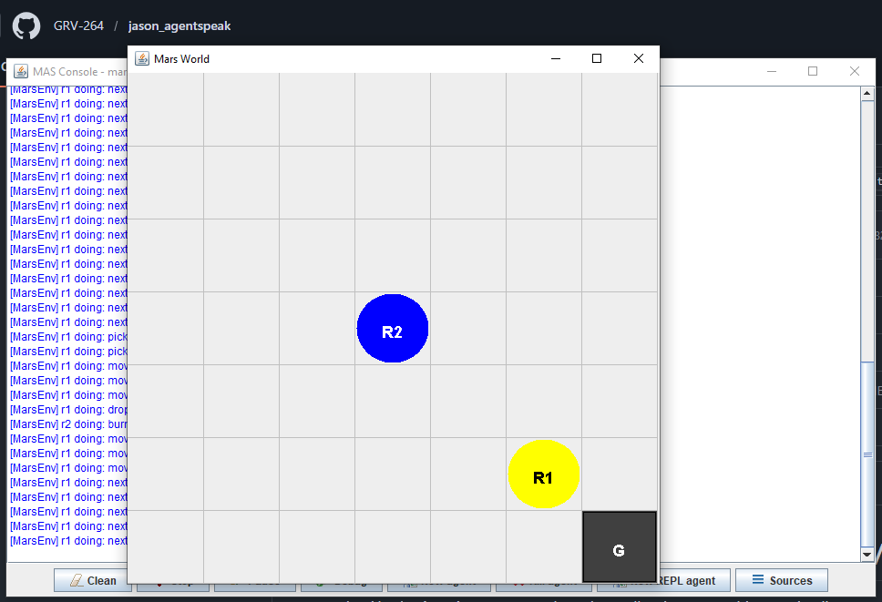

# Cleaning Robots (Mars Environment)

## 📖 Descripción
Simulación de dos robots limpiadores autónomos que recolectan basura en un ambiente tipo Marte, coordinando acciones y reaccionando a eventos.

## 🎯 Objetivo del Ejemplo
Demostrar:
- Percepción del ambiente y reacción a cambios
- Coordinación entre agentes sin comunicación directa
- Manejo de eventos en tiempo real
- Logging de actividades

## 🤖 Agentes Principales
- **r1** - Primer robot recolector
- **r2** - Segundo robot recolector

## 📋 Comportamiento Esperado

### Ciclo Completo:
1. **r1** comienza recorrido del grid (7×7 slots)
2. En cada slot:
   - Avanza a siguiente celda con `next(slot)`
   - Detecta basura (si existe): `garbage(r1)`
3. Cuando **r1** encuentra basura:
   - Ejecuta `!carry_to(r2)`: recoge la basura
   - Se mueve a posición de **r2**
   - Suelta la basura
   - **r2** automáticamente ejecuta `burn(garb)` (quema)
   - **r1** regresa a su posición anterior
   - Continúa recorrido desde donde quedó
4. **Termina** cuando **r1** completa recorrido de todo el grid (49 slots sin más basura)

## 📚 Conceptos Clave

### División de Roles:
- **r1 (recolector)**: Recorre grid, detecta basura, la lleva a r2
- **r2 (incinerador)**: Permanece estático, quema basura cuando r1 la deja

### Mecanismo de Entrega:
```
r1 recoge basura(r1) → se mueve a r2 → suelta basura → 
       ↓(percepto)
r2 recibe garbage(r2) → quema automáticamente
```

### Iteración de Grid:
- `next(slot)` avanza a siguiente celda (7×7 = 49 slots)
- **r1** recorre todas las celdas
- Encuentra basura aleatoriamente colocada en el grid

### Finalización:
- **r1** termina cuando recorre todo el grid sin basura pendiente

## 🔧 Configuración y Logging
Modificar `logging.properties` para cambiar niveles de logging:
```properties
java.util.logging.level=FINE  # Más detalle (ver todos movimientos)
java.util.logging.level=INFO   # Detalle normal
java.util.logging.level=WARNING # Solo errores
```

## 💡 Extensiones Posibles
- Agregar **r3, r4, ...**: Múltiples recolectores o incineradores
- Cambiar tamaño del grid en `MarsEnv.java` (actualmente 7×7)
- Modificar cantidad/distribución de basura
- Agregar diferentes tipos de basura con reglas específicas
- Implementar "áreas peligrosas" donde no puede entrar r1
- Agregar competencia entre recolectores por basura

## 📸 Salida de Ejemplo
