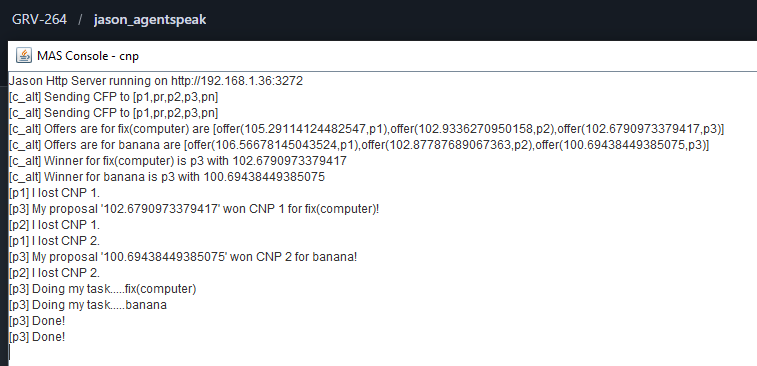

# Contract Net Protocol (CNP) - Extended Reasoning

## 📖 Descripción
Versión mejorada del CNP que aprovecha características avanzadas de Jason(ER) para implementar razonamiento extendido en la negociación, con sub-planes más sofisticados y condiciones de meta complejas.

## 🎯 Objetivo del Ejemplo
Demostrar:
- Características extendidas de Jason::ER en negociación
- Manejo avanzado de sub-planes y metas condicionales
- Negociación con razonamiento más profundo
- Condiciones complejas en propuestas

## 🤖 Agentes Principales
- **c_alt** - Iniciador con razonamiento extendido
- **p** (3 agentes) - Participantes con lógica ER
- **pr** - Participante que rechaza
- **pn** - Participante no responsivo

## 📋 Comportamiento Esperado
Similar al CNP básico, pero:
1. Los agentes evalúan propuestas con mayor complejidad
2. Razonan sobre sub-metas y dependencias entre tareas
3. Aplicar condiciones más sofisticadas en aceptación/rechazo
4. Mejor manejo de escenarios complejos de negociación

## 📚 Conceptos Clave - Características ER
- **Sub-planes avanzados**: Metas que se descomponen recursivamente
- **Condiciones meta**: Evaluación de éxito basada en múltiples criterios
- **Razonamiento Extendido**: Lógica más expresiva en los planes

## 🔍 Comparación CNP Básico vs ER

| Aspecto | CNP Básico | CNP ER |
|--------|-----------|--------|
| Propuestas | Precio simple | Complejas con condiciones |
| Evaluación | Binaria (sí/no) | Multi-criterio |
| Sub-metas | Simples | Anidadas/dependencias |
| Razonamiento | Lineal | Condicional avanzado |

## 💡 Cuándo Usar ER
- Negociaciones con múltiples criterios
- Interdependencias entre tareas
- Require razonamiento temporal o condicional complejo

## 📸 Salida de Ejemplo
