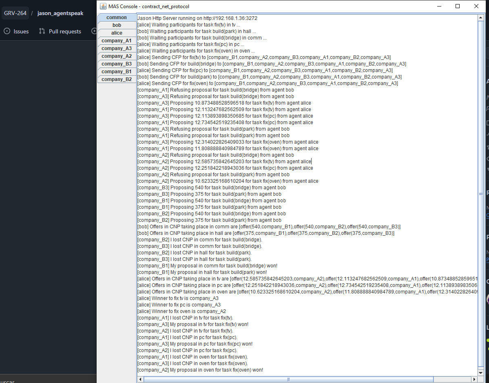

# Contract Net Protocol - Module-Based

## 📖 Descripción
Implementación del CNP usando la característica de **módulos de Jason**, permitiendo reutilización de código y separación clara de responsabilidades mediante espacios de nombres privados y públicos.

## 🎯 Objetivo del Ejemplo
Demostrar:
- Modularización de código en Jason mediante espacios privados/públicos
- Reutilización del protocolo CNP en múltiples equipos
- Arquitectura escalable de sistemas multiagente
- Separación de lógica de negociación del código específico del dominio

## 🤖 Agentes Principales
- **alice** - Iniciador que demanda 3 servicios (fix(tv), fix(pc), fix(oven))
- **bob** - Iniciador que demanda 2 servicios (build(park), build(bridge))
- **company_A** (3 agentes) - Participantes que pueden reparar pero NO construir
- **company_B** (3 agentes) - Participantes que pueden construir pero NO reparar

## 📋 Comportamiento Esperado
1. **alice** inicia 3 CNPs simultáneos (fix(tv), fix(pc), fix(oven)) en namespaces independientes
2. **bob** inicia 2 CNPs simultáneos (build(park), build(bridge)) en sus propios namespaces
3. **Total de 5 negociaciones en paralelo** sin interferencias entre ellas
4. **company_A**:
   - Acepta tareas fix() y propone precios aleatorios
   - Rechaza tareas build()
5. **company_B**:
   - Rechaza tareas fix()
   - Acepta tareas build() con precios fijos
6. Cada CNP selecciona su ganador independientemente:
   - Alice gana CNPs con mejores ofertas entre company_A
   - Bob gana CNPs con mejores ofertas entre company_B

### Ventaja Clave:
Múltiples iniciadores ejecutan múltiples CNPs en paralelo, en namespaces completamente aislados, sin contaminación de estado ni conflictos de etiquetas.

## 📚 Conceptos Clave - Módulos en Jason

### Estructura Actual de Archivos:
```
contract_net_protocol-module/
├── contract_net_protocol.mas2j    # Define agentes
├── alice.asl                       # Iniciador (carga dinámica)
├── initiator.asl                   # Lógica compartida del iniciador
├── bob.asl                         # Participante
├── company_A.asl                   # Equipo A
├── company_B.asl                   # Equipo B
└── participant.asl                 # Lógica compartida de participantes
```

### Uso Dinámico de Módulos:
En `alice.asl`, los módulos se cargan dinámicamente:
```agentspeak
!start([fix(tv),fix(pc),fix(oven)]).

+!start([fix(T)|R])
    <- .include("initiator.asl",T);  // Carga initiator.asl en namespace T
       !!T::startCNP(fix(T));         // Ejecuta en namespace T
       !start(R).
```

### Espacios de Nombres (Namespaces):
- **Público (::)**: Variables accesibles entre agentes
- **Privado (priv::)**: Variables solo dentro del módulo
- **Local (this_ns)**: Referencia al namespace actual

## 📋 Salida Esperada
```
Jason Http Server running on http://192.168.1.36:3272
[alice] Waiting participants for task fix(tv) in tv ...
[alice] Waiting participants for task fix(pc) in pc ...
[alice] Waiting participants for task fix(oven) in oven ...
[alice] Sending CFP for fix(tv) to [company_B1,company_A2,...]
[alice] Sending CFP for fix(pc) to [company_B1,company_A2,...]
[alice] Sending CFP for fix(oven) to [company_B1,company_A2,...]
[company_A1] Proposing X.XX for task fix(tv) from agent alice
[company_A1] Proposing X.XX for task fix(pc) from agent alice
[company_A1] Proposing X.XX for task fix(oven) from agent alice
... (más propuestas)
[alice] Winner to fix tv is [agente]
[alice] Winner to fix pc is [agente]
[alice] Winner to fix oven is [agente]
```

**Nota importante**: Las 3 CNPs se ejecutan **en paralelo** en diferentes namespaces (tv, pc, oven), permitiendo negociaciones independientes simultáneamente.

## 🔧 Arreglo Realizado
El ejemplo original tenía un conflicto de etiquetas de planes cuando se cargaban dinámicamente múltiples veces:
- ❌ `@p1 +!startCNP(Task)` - Etiqueta global causaba conflicto al reutilizarse
- ✅ Etiqueta removida - Cada namespace now puede cargar planes sin conflicto

Esto permite que `.include("initiator.asl",T)` funcione sinprobemas para múltiples valores de T.

## 💡 Extensiones Posibles
- Aumentar número de tareas parallelas
- Agregar más agentes participantes
- Implementar diferentes estrategias de propuesta por empresa
- Crear módulo de logging centralizado para todas las CNPs
- Agregar mecanismo de re-negociación ante incumplimiento

## 📸 Salida de Ejemplo
