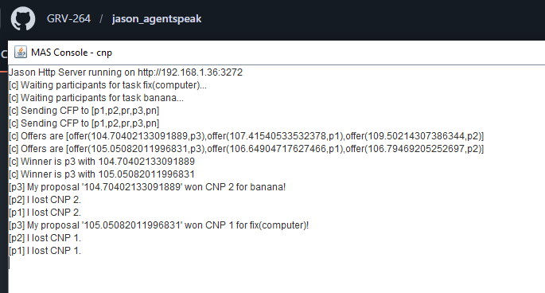

# Contract Net Protocol (CNP) - Versión Básica

## 📖 Descripción
Implementación del protocolo estándar FIPA CNP (Contract Net Protocol), donde un agente iniciador solicita propuestas, múltiples participantes responden, y se selecciona el mejor.

## 🎯 Objetivo del Ejemplo
Demostrar:
- Protocolo de negociación automática estándar en sistemas multiagente
- Ciclo completo de llamada-para-propuestas (CFP)
- Diferentes comportamientos de participantes
- Selección de contratista ganador

## 🤖 Agentes Principales
- **c** - Iniciador: requiere un servicio y abre la negociación
- **p** (3 agentes) - Participantes normales: responden propuestas
- **pr** - Participante que siempre rechaza propuestas
- **pn** - Participante que no responde (simula no disponibilidad)

## 📋 Comportamiento Esperado
1. El iniciador **c** emite un mensaje CFP (Call For Proposals)
2. Los participantes **p** evalúan si pueden completar la tarea
3. **pr** rechaza sistemáticamente
4. **pn** no responde (timeout)
5. Entre los que aceptan, se selecciona según criterio (mejor precio/tiempo)
6. Se anuncia ganador y se asigna contrato
7. Los perdedores reciben notificación de rechazo

## 📚 Conceptos Clave
- **Fase 1 - Difusión**: CFP enviado a todos los participantes
- **Fase 2 - Respuesta**: Participantes proponen términos (precio, plazo)
- **Fase 3 - Selección**: Iniciador elige la mejor propuesta
- **Fase 4 - Notificación**: Se notifica ganadores y perdedores
- **Fase 5 - Ejecución**: Contrato se ejecuta con ganador

## 💡 Extensiones Posibles
- Agregar más participantes
- Modificar criterios de selección
- Simular fallos en ejecución de contratos
- Agregar re-negociación ante incumplimiento

## 📸 Salida de Ejemplo
