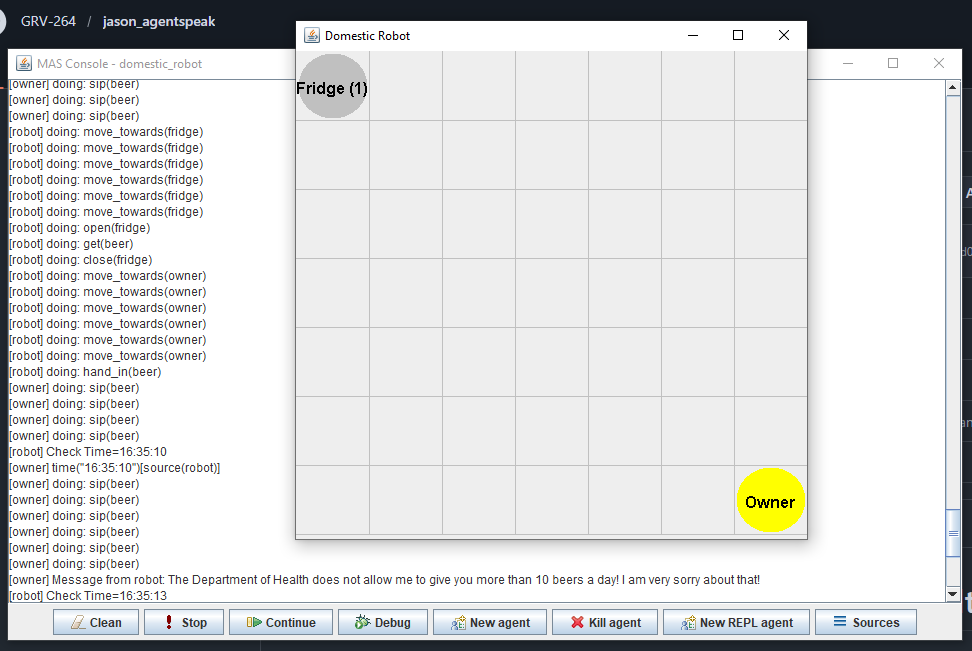

# Domestic Robot

## 📖 Descripción
Robot autónomo doméstico que trae cosas al dueño (bebidas del refrigerador) respetando límites establecidos, gestionando disponibilidad y aplicando lógica temporal.

## 🎯 Objetivo del Ejemplo
Demostrar:
- Restricciones en creencias y estado persistente
- Interacción robot-ambiente-usuario
- Razonamiento temporal y límites
- Arquitecturas colaborativas robot-humano

## 🤖 Agentes Principales
- **robot** - Ejecutor autónomo que trae bebidas del fridge
- **owner** - Dueño que solicita servicios al robot
- **fridge** - Dispositivo que almacena bebidas (nevera)
- **supermarket** - Proveedor de bebidas (definido pero no usado en este ejemplo)

## 📋 Comportamiento Esperado
1. El **owner** solicita una bebida (beer) al robot
2. El robot verifica:
   - ¿Hay cerveza disponible en el **fridge** (nevera)?
   - ¿Se ha excedido el límite diario de cervezas?
3. Si hay disponibilidad y no se excedió límite:
   - Se mueve al fridge
   - Abre el fridge
   - Obtiene la cerveza
   - Cierra el fridge
   - Se mueve al owner
   - Entrega la cerveza
   - Registra el consumo del día
4. Si se excedió límite: rechaza la solicitud
5. Mantiene registro temporal de consumo por día

## 📚 Conceptos Clave

### Restricciones Temporales:
El robot respeta límite máximo de cervezas por día usando fecha/hora:

```agentspeak
limit(beer,10).  // Máximo 10 cervezas por día
too_much(B) :- ...count(consumed(YY,MM,DD,_,_,_,B),Qty) & Qty > Limit
```

### Estado Persistente:
Las creencias se mantienen a lo largo de múltiples interacciones:
- `available(beer,fridge)` - Creencia sobre disponibilidad
- `consumed(YY,MM,DD,HH,NN,SS,beer)` - Registro temporal de consumo

### Comportamiento Reactivo:
- `+!has(owner,beer)` - Meta: el owner necesita cerveza
- El robot reacciona buscando condiciones (hay cerveza + no excedió límite)
- Secuencia de acciones: mover → abrir → tomar → cerrar → entregar

### Interacción Robot-Ambiente:
- **Robot ↔ Owner**: Solicitudes y entregas
- **Robot ↔ Fridge**: Extracción de bebidas
- Ambiente simula posiciones (robot en fridge vs. owner)

## 🏠 Ambiente Simulado
- **HouseEnv.java**: Implementa acciones del robot (open, close, get, hand_in) y percepción
- **HouseModel.java**: Mantiene estado del mundo (posiciones, recursos, tiempo)
- **HouseView.java**: Visualización gráfica opcional del ambiente

### Locaciones:
- **fridge**: Lugar donde se almacenan bebidas
- **owner**: Posición del dueño

### Acciones Disponibles:
- `!at(robot,location)` - Moverse a una localización
- `open(fridge)` - Abrir la nevera
- `get(beer)` - Obtener cerveza
- `close(fridge)` - Cerrar la nevera
- `hand_in(beer)` - Entregar al owner

Se abrirá la interfaz gráfica mostrando al robot moviendose por la casa.

## 💡 Extensiones Posibles
- Cambiar líquido de cerveza a otro (vino, zumo, agua)
- Modificar límite diario (actualmente 10 cervezas)
- Agregar más tipos de bebidas con límites individuales
- Implementar uso real del agente **supermarket** para reabastecer el fridge
- Agregar más servicios (traer platos, ropa, comida)
- Incorporar preferencias del owner (temperatura, tipo de bebida)
- Agregar horarios (solo servir en ciertas horas del día)

## 📸 Salida de Ejemplo
