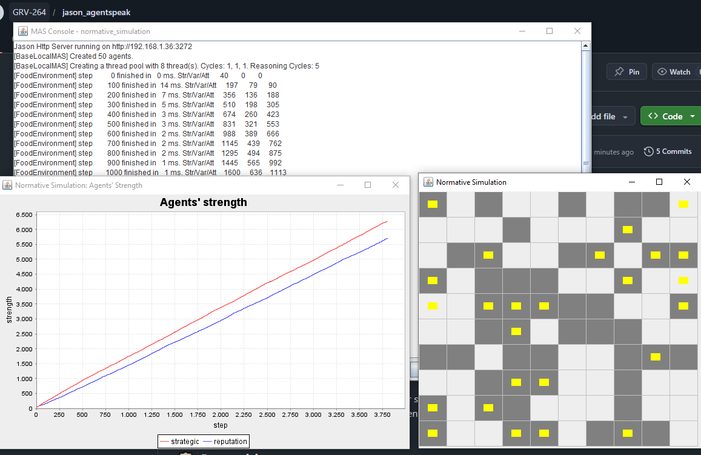

# Food Simulation

## 📖 Descripción
Simulación compleja de agentes (predadores) buscando comida en un territorio, compitiendo por recursos, con sistema de energía, ataques y percepción limitada.

## 🎯 Objetivo del Ejemplo
Demostrar:
- Simulación multiagente realista con múltiples aspectos
- Percepción limitada del ambiente (vista, olfato, proximidad)
- Competencia por recursos
- Dinámicas predador-presa
- Sistema de energía y supervivencia

## 🤖 Agentes Principales (por defecto en FoodSimulation.mas2j)

La simulación está configurada con dos tipos de agentes competitivos:

- **strategic** (25 agentes) - Utilizan estrategia para buscar comida y competir
- **reputation** (25 agentes) - Utilizan sistema de reputación en sus decisiones

**Total: 50 agentes** compitiendo por 25 unidades de comida en grid 10×10

### Alternativas disponibles (comentadas):
- **blind** - Agentes sin percepción visual
- **normative** - Agentes que siguen normas sociales
- **normativerule** - Variante de normativo con reglas

Puedes comentar/descomentar en `FoodSimulation.mas2j` para probar diferentes mezclas de estrategias

## 📋 Comportamiento Esperado
1. Los agentes se crean dinámicamente en el ambiente
2. Cada agente busca comida usando múltiples formas:
   - **Vista**: Detecta comida en rango visual cercano
   - **Olfato**: Percibe depósitos de comida a mayor distancia
   - **Detección cercana**: Comida en la misma posición
3. Consumen energía al moverse
4. Pueden atacar a otros agentes para robar comida/territorio
5. Mueren cuando agota la energía
6. Se crean nuevos agentes constantemente

## 📚 Conceptos Clave

### Percepción Escalonada:
```
Rango cercano (15m) → Detecta comida exacta
Rango medio (50m)   → Detecta olor de comida
Rango lejano        → Solo move aleatoriamente
```

### Dinámicas Ecológicas:
- Competencia por comida limita población
- Movimiento consume recursos
- Combate resuelve conflictos

### Simulación Realista:
Usa la carpeta `src/` con código Java personalizado para fisica del mundo

## 🗂️ Estructura
```
food-simulation/
├── FoodSimulation.mas2j           # Configuración del MAS
├── src/asl/                       # Código AgentSpeak
├── src/                           # Código Java del ambiente
├── lib/                           # Librerías específicas
└── build/                         # Artefactos compilados
```

### Configuración de Parámetros:
En `FoodSimulation.mas2j`:
```mas2j
environment: FoodEnvironment(gridSize, numAgents, numFood)
```

Parámetros por defecto:
- **gridSize** = 10 (grid 10×10)
- **numAgents** = 50 (agentes iniciales)
- **numFood** = 25 (unidades de comida en el ambiente)

## 🎮 Interfaz Visual de la Simulación

### La Cuadrícula (Grid)
- **Territorio 10×10** donde ocurre la simulación
- **Cada celda** puede contener agentes y comida
- **Colores visibles**:
  - 🔲 **Gris oscuro** = Agentes (predadores buscando comida)
  - 🟨 **Amarillo** = Comida disponible en el territorio
  - ⬜ **Blanco/vacío** = Celdas sin recursos

### La Gráfica (Chart)
- **Título**: "Agents' Strength" (Fuerza de los agentes)
- **Eje X**: Número de pasos simulados
- **Eje Y**: Fuerza promedio de los agentes
- **Líneas mostradas**:
  - 🔵 **Línea azul** = Fuerza promedio de agentes **"strategic"** (25 agentes)
  - 🔴 **Línea roja** = Fuerza promedio de agentes **"reputation"** (25 agentes)
  
**Interpretación**: 
- Cada línea muestra la energía promedio de su grupo
- Cuando bajan, usan mucha energía (moviéndose/atacando)
- Cuando suben, están recuperando energía (comiendo)
- Comparar ambas líneas muestra cuál estrategia es más efectiva

**Ventana que se abre**:
- Izquierda: La cuadrícula (grid) con agentes moviéndose
- Derecha/Abajo: La gráfica de estadísticas en tiempo real
- Terminal: Métricas cada 100 pasos

## 💡 Extensiones Posibles
- Crear nuevas estrategias de agentes en `src/asl/`
- Modificar parámetros del grid (aumentar tamaño o comida)
- Implementar nuevos mecanismos de percepción
- Agregar sistema de aprendizaje entre agentes
- Exportar datos de la simulación para análisis posterior

## 📸 Salida de Ejemplo

