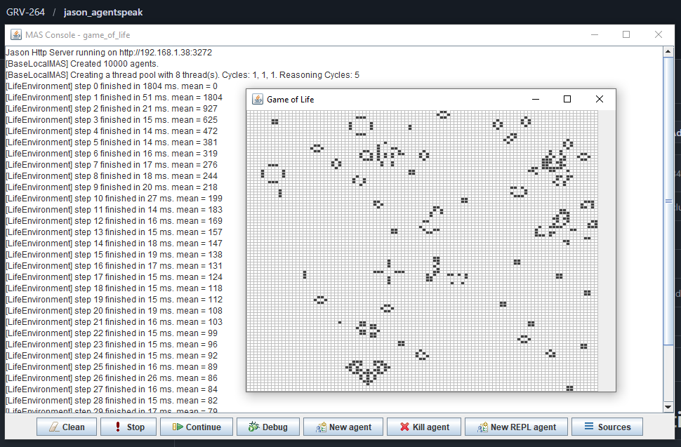

# Game of Life

## 📖 Descripción
Implementación del clásico autómata celular "Juego de la Vida" de Conway con **10,000 agentes simultáneos** (grid 100×100), demostrando escalabilidad en Jason.

## 🎯 Objetivo del Ejemplo
Demostrar:
- Escalabilidad de Jason: manejo de miles de agentes
- Sincronización global entre agentes
- Patrones emergentes en sistemas descentralizados
- Computación distribuida simple pero masiva

## 🤖 Agentes Principales
- **cell** (10,000 instancias) - Células individuales en grid de 100×100

Cada célula es un agente autónomo que:
- Conoce su posición (X, Y)
- Observa estado de vecinos (8 direcciones)
- Aplica reglas de vida/muerte cada ciclo

## 📚 Reglas Implementadas

| Condición | Resultado |
|-----------|-----------|
| Exactamente 2 vecinos vivos | Mantiene estado actual (skip) |
| Exactamente 3 vecinos vivos | Se vuelve viva (live) |
| Cualquier otra cantidad | Muere (die) |

**Nota:** Esta es una versión simplificada de Conway's Game of Life. No verifica el estado previo de la célula, solo cuenta vecinos.

## 📋 Comportamiento Esperado
1. Se inicializa grid 100×100 con células al 10% de densidad viva inicial
2. Cada ciclo de 3000ms, todas las células reciben el evento `step` y evalúan su estado:
   - Si tienen 2 vecinos vivos: mantienen su estado actual
   - Si tienen 3 vecinos vivos: se vuelven vivas
   - En cualquier otro caso: mueren
3. Las actualizaciones son gobernadas por `TimeSteppedEnvironment` (sincronización global)
4. La visualización se actualiza en tiempo real con células vivas (gris oscuro) y muertas (blancas)
5. El sistema es capaz de mantener 10,000 agentes simultáneos con pool de 8 threads

## 🎨 Componentes Técnicos

### LifeEnvironment.java
- Extiende `TimeSteppedEnvironment` para sincronización global
- Timeout de paso: 3000ms
- EjecComportamiento del Agente Cell

Cada agente `cell` ejecuta planes en respuesta a eventos `+step(_)`:

```
// Si exactamente 2 vecinos: mantiene su estado
+step(_) : alive_neighbors(2) <- skip.

// Si exactamente 3 vecinos: se vuelve vivo
+step(_) : alive_neighbors(3) <- live.

// Cualquier otro número de vecinos: muere
+step(_) <- die.
```
⚙️ Configuración Modificable

En `game-of-life.mas2j`:
```mas2j
environment: LifeEnvironment(100,10) // tamaño=100, densidad_inicial=10%
infrastructure: Local(pool,8)        // pool de 8 threads
agents: cell [verbose=0] #10000;     // 10,000 agentes
```

## 🔧 Extensiones Posibles
- Cambiar tamaño del grid y cantidad de agentes
- Modificar densidad inicial (10% → X%)
- Cambiar timeout de paso (3000ms)
- Implementar reglas más cercanas a Conway estándar
- Agregar toroidal wrap-around en bordes (actualmente límites rectangulares)

## 💡 Patrones Clásicos Observables

```Still Life (Bloque):
██
██

Oscillator (Blinker):
Ciclo 1:    Ciclo 2:
 █          ███
 █          
 █          
```

## 📊 Performance y Escalabilidad
- **10,000 agentes simultáneos** en grid 100×100
- **Actualizaciones sincrónicas** cada 3000ms mediante `TimeSteppedEnvironment`
- **Pool de 8 threads** (no 1 thread por agente) para eficiencia
- **Tiempo de ciclo medio**: ~54ms (como se ve en consola)
- Cada agente procesa percepciones y ejecuta acciones en paralelo
- Demuestra viabilidad de sistemas multiagente a escala masiva en un solo JVM
- Cambiar tamaño del grid
- Toroidal wrap-around (bordes conectados)
- Agregar colores o edades a células
- Múltiples poblaciones con reglas diferentes

## 📖 Referencia
Conway's Game of Life: <https://en.wikipedia.org/wiki/Conway%27s_Game_of_Life>

## ⚙️ Performance
- 10,000 agentes simultáneos
- Actualizaciones sincrónicas cada ciclo
- Demuestra viabilidad de sistemas multiagente a escala

## 📸 Salida de Ejemplo

