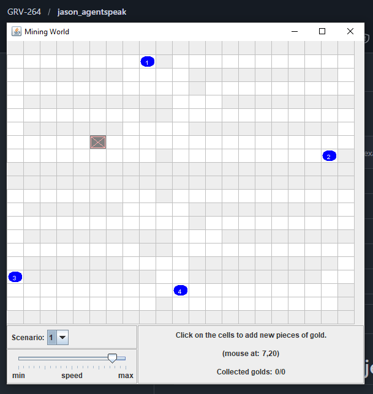
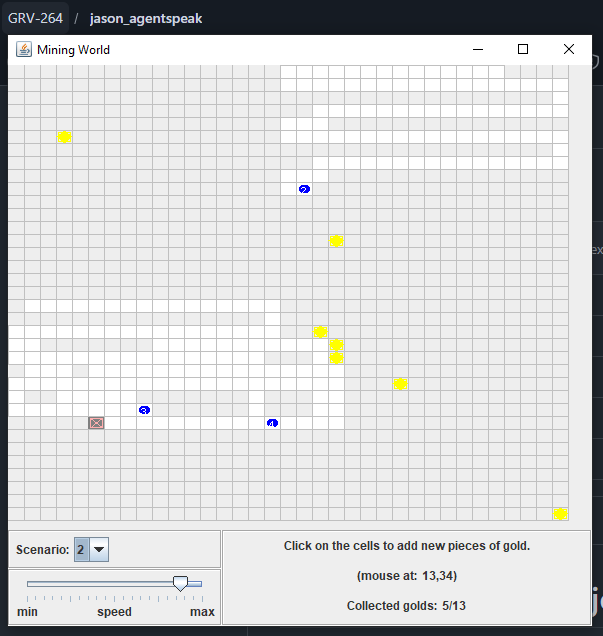
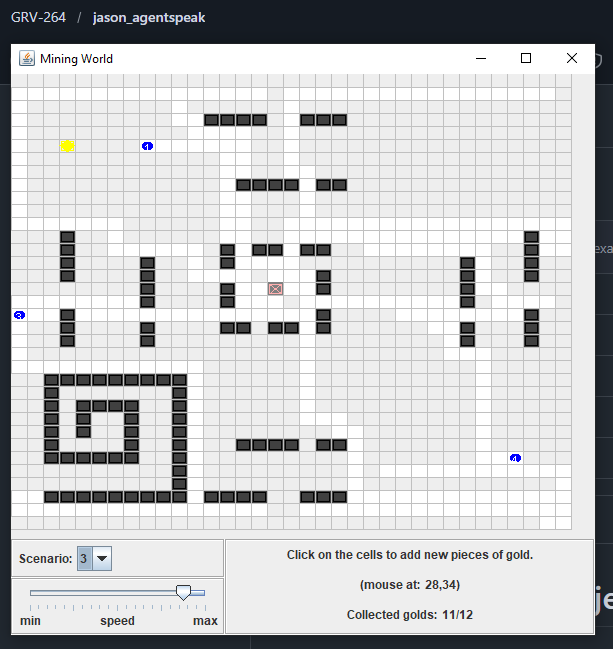

# Gold Miners I

## 📖 Descripción
Sistema colaborativo de minería de oro donde un agente **líder** coordina y asigna cuadrantes estáticos a 4 **mineros** que exploran, descubren y extraen oro. Utiliza negociación de pujas para asignar dinámicamente el oro encontrado al minero más cercano, demostrando coordinación centralizada con negociación distribuida.

## 🎯 Objetivo del Ejemplo
Demostrar:
- Arquitectura con agente líder centralizado
- Asignación estática de territorios (cuadrantes)
- Negociación distribuida mediante pujas (bidding)
- Coordinación centralizada de recursos compartidos
- Exploración sistemática del espacio

## 🤖 Agentes Principales
- **leader** - Coordinador central que divide el mapa en cuadrantes y asigna trabajos
- **miner** (4 agentes) - Mineros que exploran, buscan y extraen oro en sus cuadrantes asignados

## 📋 Comportamielee el tamaño del mapa y divide el espacio en **4 cuadrantes estáticos**
2. Espera a que los 4 **mineros** envíen su posición inicial
3. Asigna cada cuadrante al minero más cercano (distancia Euclidiana)
4. Los **mineros** comienzan a explorar su cuadrante asignado:
   - Se desplazan sistemáticamente buscando piezas de oro
   - Al encontrar oro, envían una **puja (bid)** al leader con su distancia aproximada
5. El **leader** recibe 4 pujas máximo y selecciona al minero más cercano
6. Comunica a todos los mineros qué minero fue asignado al oro
7. El minero asignado extrae el oro y lo deposita en el depot
8. Simulación dura **60 segundos**
9. La ejecución es colaborativa (no competitiva): todos trabajan bajo un líderdetecta desbalances
6. Mantiene registro de producción y eficiencia

## 1. Asignación de Cuadrantes (Inicio)
```
Líder (coordina)
├─ Miner 1 → Cuadrante NW (X1-X2, Y1-Y2)
├─ Miner 2 → Cuadrante NE (X2-W,  Y1-Y2)
├─ Miner 3 → Cuadrante SW (X1-X2, Y2-H)
└─ Miner 4 → Cuadrante SE (X2-W,  Y2-H)
```
Cada minero explora solo su cuadrante asignado sin reasignación.

### 2. Sistema de Pujas (Negociación Distribuida)
Cuando un minero descubre oro:
1. Cálculo de distancia desde posición actual al oro
2. Cada minero envía: `bid(gold_id, distance, miner_name)`
3. Leader recibe máximo 4 pujas (una por minero)
4. Leader selecciona: `allocate_miner(gold_id)` → elige distancia MÍNIMA
5. Leader comunica: `broadcast(allocated(gold_id, winner_miner))`
6. Minero ganador: `pick()` y `drop()` en depot

### 3. Ciclo de Exploración (Minero)
1. Recibir cuadrante: `quadrant(X1, Y1, X2, Y2)`
2. Desplazamiento sistemá     # Lógica del coordinador
│   ├─ @quads: divide mapa en 4 cuadrantes
│   ├─ assign_quad: asigna cuadrante a minero más cercano
│   └─ negotiate: recibe pujas y asigna oro al más cercano
├── miner.asl                 # Lógica de mineros
│   ├─ send_init_pos: comunica posición inicial
│   └─ explore: patrón sistemático en cuadrante
├── jasonTeam.mas2j           # Configuración MAS
├── mining/
│   ├── MiningPlanet.java     # Ambiente (ejecuta acciones)
│  🎮 Escenarios (WorldModel)

| Escenario | Descripción | Oro Total | Complejidad |
|-----------|-------------|-----------|-------------|
| **Scenario 1** | Vacío sin oro | 0 | Mínima (base) |
| **Scenario 2** | Oro disperso aleatoriamente | 13 | Media |
| **Scenario 3** | Vetas organizadas (clusters) | 12 | Alta |

Se**Collected golds**: Contador en GUI muestra oro depositado en depot (e.g., "5/13")
- **Tiempo total**: 60 segundos de simulación
- **Eficiencia de pujas**: Porcentaje de oro asignado correctamente al minero más cercano
- **Cobertura**: Proporción del cuadrante explorada por cada minero
- **Distribución de carga**: Oro extraído por cada minero (visibles en GUI)Team.mas2j` → `miner #6;`
- Modificar distribución de oro: editar `WorldModel.java` (world1, world2, world3)
- Cambiar timeout de simulación: `MiningPlanet.SIM_TIME = 120;` (segundos)
- Aumentar/decrecer densidad de oro inicial
- Modificar tamaño del grid: `MiningPlanet(N, 50, yes)` → `(N, 100, yes)`
- Agregar complejidad: cambiar patrones de exploración

## 🗂️ Estructura
```
gold-miners/
├── leader.asl           # Lógica del coordinador
├── miner.asl           por Escenario
```

### Scenario 1: Exploración Inicial (sin oro)

- 4 mineros en posiciones iniciales (azules)
- Depot (cruz roja) visible en centro
- Oro recogido: 0/0
- Mineros comienzan a separarse hacia sus cuadrantes

### Scenario 2: Oro Disperso (extracción en progreso)

- Oro (cuadrados amarillos) distribuido aleatoriamente
- Mineros explorando activamente sus cuadrantes
- Oro recogido: 5/13 (38% completado)
- Negociación de pujas activa cuando encuentran oro

### Scenario 3: Vetas Organizadas (máxima complejidad)

- Múltiples vetas de oro (clusters negros) distribuidas estratégicamente
- Mayor concentración: más pujas simultáneas
- Oro recogido: 11/12 (92% completado)
- Patrón de exploración sistemática claramente visible
- Minero 1 (azul) en su región de cuadrantee simulado
```
└── doc/                 # Documentación adicional
```

## 💡 Modificaciones Posibles
- Aumentar número de mineros (5, 6, 8...)
- Adicionar competencia entre equipos diferentes
- Implementar minería cooperativa vs. competitiva
- Agregar recursos naturales limitados globalmente
- Crear subastas para reasignación de cuadrantes

## 🏆 Métricas Observables
- Oro extraído por minero
- Eficiencia por cuadrante
- Tiempo de extracción
- Justicia en distribución de tareas

## 📸 Salida de Ejemplo


